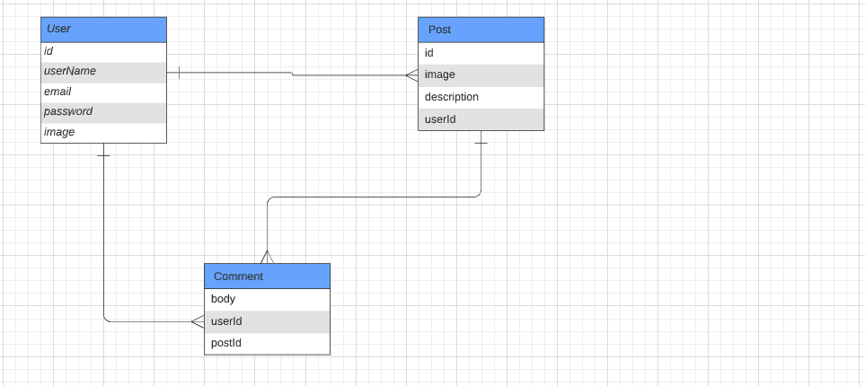
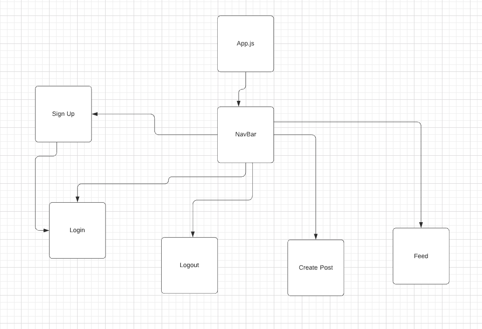

# The TravelGram FrontEnd

## Summary
If you've ever thought about traveling, you've probably wondered where you should go, what destination is trending, or where your friends are going right? Fear no more, because we've got the site for you! Here we present to you Travelgram! This is hottest site to either check on your friends, plan a nice little honeymoon, or even a weekend away from the kids. Ah, we all need that once in a while. Here you'll be able to post up what's your next dream vacation, and connect to hundreds of people just like you, who are all getting ideas for their next trip, or taking you on the adventure with them! 

## Back-End

### Database/ Collections

For our database, we will be giving you the chance to make an account with an encrypted/protected password. You'll be able to create an account and be confident that your data won't be breached by one of those nasty hackers! You can post your dream traveling locations, check out the hotspots, and add a comment to theirs!

This will all be done with the expertise of our backend crew. They will give the user access to be able to add posts,  and comments with something called a many to many relationship! This is what that looks like:

### Controllers

We will create controller methods to access the entries from each collection, and have a full CRUD for the database.

### Authentication

We will implement authentication to our database to protect are users from experiencing any hackers to enter their account, with the help of JWT!

## Front-End

We will have our website land on the home screen,and will only be accessible to those who have registered an account with us. We will also implement a NavBar that will allow users to register if they don't have an account, login if they're not already logged in, logout if they do not wish to be logged in, post their next vacations, and finally, see our beautiful site once they are logged in. The feed file will consist of users posts and comments on their dream, current, or their past vacations. It will look something like this:

## Plan of Action

We've broken down our team into three separate groups, frontend, backend, and middleware. Each member will have their own duties, and have the most important duty of helping out their teammates when they're stuck. We are a high functioning team, and emphasize teamwork.

## Front-End
### Alex Barbosa

### [LinkedIn](https://www.linkedin.com/in/alexbarbosa1/)
### [GitHub](https://github.com/barboa91)

## Middle-Ware
### Brynner Ventura

### [LinkedIn](https://www.linkedin.com/in/brynner-ventura/)
### [GitHub](https://github.com/Brynner03)

## GJ Haaland
### Role
Back-End

### [LinkedIn](https://www.linkedin.com/in/gj-haaland/)
### [GitHub](https://github.com/GG-Haaland)

## Resources:

### [Lucid ERD Diagram](https://lucid.app/lucidchart/a5f575bf-e4c6-4691-9a52-0da71e0476f3/edit?beaconFlowId=C1B346EEF55AC884&invitationId=inv_fcd2cf41-861a-4d1a-8bb2-d379ad521466&page=0_0#)

